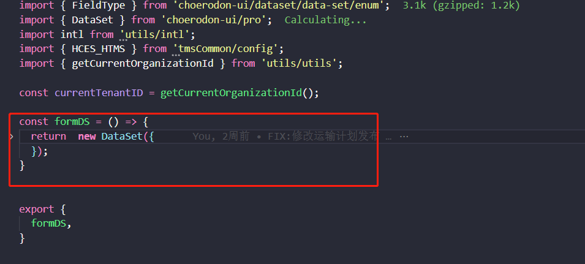
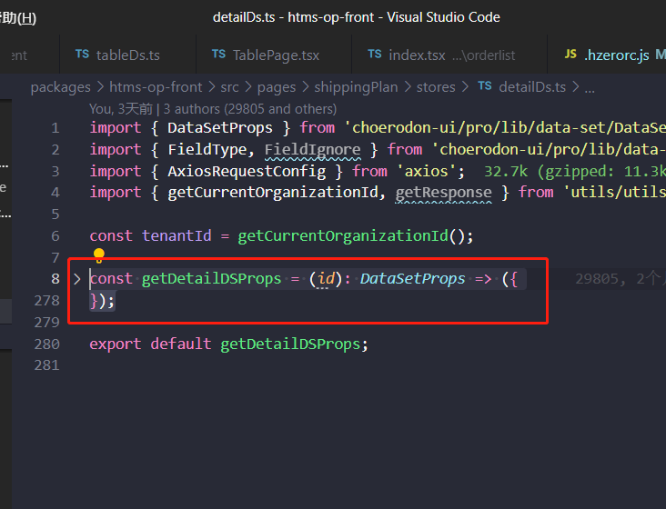

<!--
 * @Author: 刘涟洲 1228429427@qq.com
 * @Date: 2022-07-28 17:52:25
 * @LastEditors: 刘涟洲 1228429427@qq.com
 * @LastEditTime: 2022-12-19 10:45:15
 * @FilePath: \ds-helper\README.md
 * @Description: 这是默认设置,请设置`customMade`, 打开koroFileHeader查看配置 进行设置: https://github.com/OBKoro1/koro1FileHeader/wiki/%E9%85%8D%E7%BD%AE
-->
# ds-helper

帮助你生成ds的模板代码，提高开发效率

# 安装

- https://marketplace.visualstudio.com/items?itemName=llzQAQ.ds-helper

# 使用

-  选中你需要生成模板的ds代码
-  like this

-  or this

- `alt + d`： 选择生成模板（Form or Table）生成代码。

